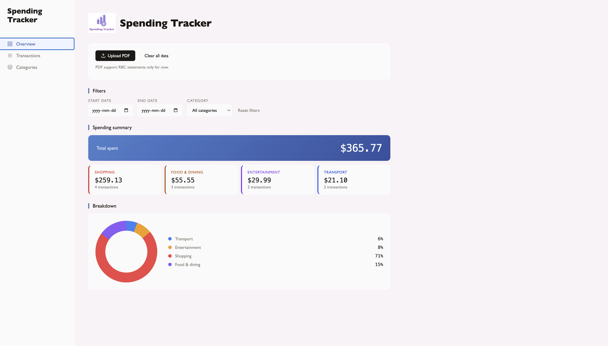
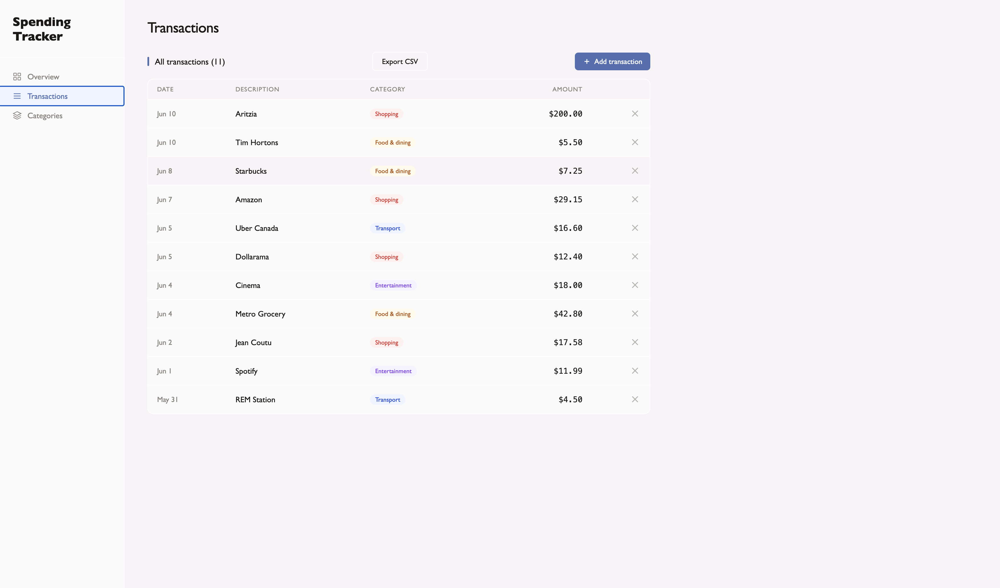
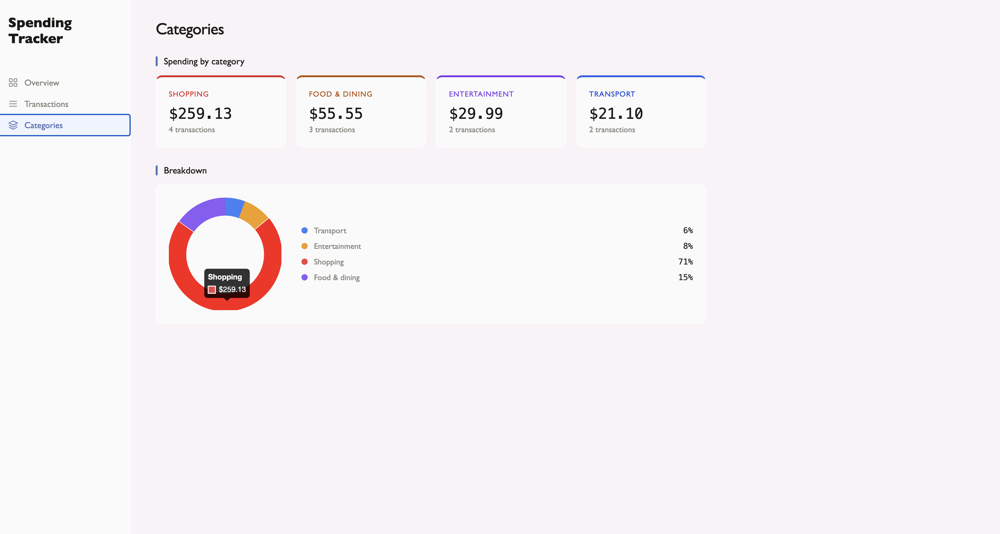

# Spending Tracker

A full-stack expense tracking web application that allows users to add, edit, delete, filter, and visualize personal transactions.

## Preview

Frontend preview: https://spending-tracker-m.netlify.app

> Note: The deployed preview shows the user interface. To use the full application with database features, run the project locally with the backend and MySQL setup below.

## Features

* Add, edit, and delete transactions
* Filter transactions by date and category
* View total spending summaries
* Visualize spending by category using Chart.js
* Import bank statement PDFs using Node.js and pdf-parse
* Store transaction data in a MySQL database
* RESTful Express.js backend with CRUD routes

## Tech Stack

* HTML
* CSS
* JavaScript
* Chart.js
* Node.js
* Express.js
* MySQL
* Multer
* pdf-parse

## Screenshots

### Dashboard


### Transactions


### Categories


## Project Structure

```text
SpendingTracker/
├── backend/
│   ├── server.js
│   ├── package.json
│   └── package-lock.json
│
├── frontend/
│   ├── index.html
│   ├── style.css
│   ├── app.js
│   └── images/
│
├── screenshots/
├── .gitignore
└── README.md
```

## Running Locally

### 1. Clone the repository

```bash
git clone https://github.com/micheleS2006/SpendingTracker.git
cd SpendingTracker
```

### 2. Install backend dependencies

```bash
cd backend
npm install
```

### 3. Create a `.env` file inside the backend folder

```env
DB_HOST=localhost
DB_USER=root
DB_PASSWORD=
DB_NAME=spending_tracker
```

### 4. Create the MySQL database

Open MySQL and run:

```sql
CREATE DATABASE spending_tracker;

USE spending_tracker;

CREATE TABLE transactions (
  id INT AUTO_INCREMENT PRIMARY KEY,
  date DATE NOT NULL,
  description VARCHAR(255) NOT NULL,
  category VARCHAR(100) NOT NULL,
  amount DECIMAL(10,2) NOT NULL
);
```

### 5. Start the backend

```bash
node server.js
```

The backend should run at:

```text
http://localhost:3000
```

### 6. Open the frontend

Open `frontend/index.html` using Live Server.

## API Endpoints

| Method | Endpoint            | Description                           |
| ------ | ------------------- | ------------------------------------- |
| GET    | `/transactions`     | Get all transactions                  |
| POST   | `/transactions`     | Add a new transaction                 |
| PUT    | `/transactions/:id` | Update a transaction                  |
| DELETE | `/transactions/:id` | Delete a transaction                  |
| DELETE | `/transactions`     | Delete all transactions               |
| POST   | `/upload`           | Upload and parse a PDF bank statement |

## Future Improvements

* Complete full cloud deployment with hosted database
* Add user authentication
* Improve PDF parsing accuracy
* Add monthly spending trends
* Add budget goals
* Implement CSV export functionality

## Author

Michèle Sossou
GitHub: https://github.com/micheleS2006
